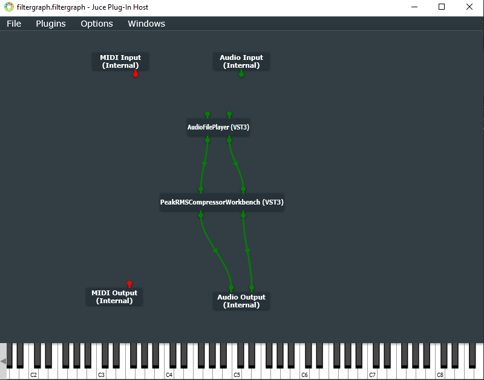

# PeakRMSCompressorWorkbench

This repository hosts **PeakRMSCompressorWorkbench**, a [JUCE-based](https://github.com/juce-framework/JUCE) application inspired by the [CTAGDRC project](https://github.com/p-hlp/CTAGDRC) designed to test and analyze the effects of **dynamic range compression** algorithms on audio signals using **peak-based and RMS-based level detection** methods. It provides tools to measure and compare these effects via various metrics.

This application was developed as part of the bachelor's thesis titled *Experimental Workbench for Testing Audio Signal Dynamic Range Compression Algorithms.*


---

## Features

- **Peak and RMS Compression**: Analyze compression behavior using peak-based and RMS-based level detection methods.
- **Metrics Extraction**: LUFS, dynamic range, crest factor, and other key metrics.
- **Real-time Playback**: Integrates with [AudioFilePlayerPlugin](https://github.com/hollance/AudioFilePlayerPlugin) by **Matkat Music** for testing in real-time.

### Output Path Configuration
- The export metrics functionality saves the computed metrics as a `.txt` file. The default export directory is specified in the **`Config.h`** file located in:
  `util/include/Config.h`

- **Windows Default Output Path**: 
  `C:\Users\Public\Documents`

- **MacOS Default Output Path**: 
  `/Users/Shared/`
  
  In the output directory, the metrics files are saved under the `/PeakRMSCompressorWorkbench_testing_results` folder.

- **Compressed Files**:
  In `Config.h`, you can configure whether the compressed audio files should also be saved alongside the metrics. By default, this option is set to **false**.

To customize the output behavior, update the appropriate parameters in the **`Config.h`** file before running the application.

### Adding a New Preset to `Presets.h`

To add a new preset:

1. **Define the Preset**:
   - Open `util/include/Presets.h`.
   - Add a new `PresetData` entry inside the `Presets` namespace.

     Example:
     ```cpp
     constexpr PresetData Piano = {
         6, "Piano",
         { -22.0f, 3.5f, 15.0f, 90.0f, 1.5f, 0.0f }, // Peak
         { -24.0f, 3.8f, 20.0f, 120.0f, 1.8f, 0.0f } // RMS
     };
     ```

2. **Add to the Preset List**:
   - Add the new preset to `AllPresets`:
     ```cpp
     constexpr auto AllPresets = std::array{
         Drums, Bass, Guitar, Vocals, FullMix, Piano
     };
     ```

3. **Save and Rebuild**:
   - Save `Presets.h` and rebuild your project.

**Notes**:
- Ensure the `id` is unique.
- Use valid parameter ranges (defined in `util/include/Constants.h`).

---

## Setup Guides

- [Windows Setup](#windows-setup)
- [MacOS Setup](#macos-setup)

## Windows Setup

### Prerequisites

To set up and run this project, ensure you have the following installed:

1. [JUCE](https://juce.com/): A C++ framework for audio application development.
2. [AudioFilePlayerPlugin](https://github.com/hollance/AudioFilePlayerPlugin): Required for real-time audio compression playback.
3. [Visual Studio Community Edition 2022](https://visualstudio.microsoft.com/): The IDE for building the project.

- The project is **not** compatible with Visual Studio 2019 version.

---

### Step-by-Step Setup Guide
*(Based on [this video tutorial](https://youtu.be/Mo0Oco3Vimo?si=CIXw9uVYdAGgwvrk&t=1360))*

---

#### 1. Clone the Repository
```bash
git clone https://github.com/s1m0ness/PeakRMSCompressorWorkbench.git
```

---

#### 2. Run Setup Script
Run the `setup.sh` script located in the `PeakRMSCompressorWorkbench` repository root to ensure `Config.h` stays local and doesn't get committed accidentally:
```bash
./setup.sh
```

---

#### 3. Install Visual Studio 2022
*(Video reference: [23:17](https://youtu.be/Mo0Oco3Vimo?si=KT-B_rA4bZAtaKIj&t=1397))*
- Download and install **[Visual Studio Community Edition 2022](https://visualstudio.microsoft.com/)**.
- During installation, select the **Desktop Development with C++** workload.

---

#### 4. Install JUCE Framework
*(Video reference: [27:32](https://youtu.be/Mo0Oco3Vimo?si=JDXoQBc6IURfOlis&t=1652))*
- Clone the JUCE repository:
  ```bash
  git clone https://github.com/juce-framework/JUCE.git
  ```
- Navigate to the Projucer build directory:
  ```plaintext
  JUCE\extras\Projucer\Builds\VisualStudio2022
  ```
- Open `Projucer.sln` in Visual Studio and build it.

---

#### 5. Modify VST3 Permissions
*(Video reference: [37:36](https://youtu.be/Mo0Oco3Vimo?si=sD74MpbJAyOmU3MD&t=2256))*
- Navigate to the following directory:
  ```plaintext
  C:\Program Files\Common Files
  ```
- Right-click the `VST3` folder (create it if doesn't exist), select **Properties**, then go to the **Security** tab.
- Select **Users** and allow modification permissions. Click **Apply**.

---

#### 6. Set Up AudioFilePlayerPlugin and JUCE Global Paths
*(Video reference: [42:06](https://youtu.be/Mo0Oco3Vimo?si=l5YVJTxdnHX2p-Gb&t=2526), [29:32](https://youtu.be/Mo0Oco3Vimo?si=uqpybmnKDi5PjgDB&t=1772))*
- Clone the AudioFilePlayerPlugin repository:
  ```bash
  git clone https://github.com/hollance/AudioFilePlayerPlugin.git
  ```
- Navigate to the directory:
  ```plaintext
  AudioFilePlayerPlugin\
  ```
- Right-click on `AudioFilePlayer.jucer` and select **Open in Program** and navigate to:
  ```plaintext
  JUCE\extras\Projucer\Builds\VisualStudio2022\x64\Debug\App
  ```
  and select `Projucer.exe` file (you can ignore this step if the .jucer file is already recognized).
- Once the project opens in Projucer, go to **File > Global Paths > JUCE Modules**, click on **Select directory** and navigate to:
  ```plaintext
  JUCE\modules
  ```
- in Projucer, click on Visual Studio exporter and build the solution.
---

#### 7. Set Up AudioPluginHost
*(Video reference: [35:32](https://youtu.be/Mo0Oco3Vimo?si=WoisnAayUc8t_EST&t=2132))*
- Navigate to the JUCE AudioPluginHost directory:
  ```plaintext
  JUCE\extras\AudioPluginHost
  ```
- Open `AudioPluginHost.jucer` in Projucer, click on Visual Studio exporter and build the solution.

---

#### 8. Configure the PeakRMSCompressorWorkbench Project
*(Video reference: [36:06](https://youtu.be/Mo0Oco3Vimo?si=rt7h6I_aILSQKOo4&t=2166))*
- Navigate to your `PeakRMSCompressorWorkbench` directory.
- Open `PeakRMSCompressorWorkbench.projucer` in Projucer and open the project in Visual Studio.
- In Visual Studio:
  - Right-click on `PeakRMSCompressorWorkbench_VST3` in Solution Explorer and select **Properties**.
  - Go to **Configuration Properties > Debugging**.
  - Click on the **Command** field, select **<browse...>** and navigate to:
    ```plaintext
    JUCE\extras\AudioPluginHost\Builds\VisualStudio2022\x64\Debug\App
    ```
  - Select `AudioPluginHost.exe` and click **Apply**.

---

#### 9. Test the Project
*(Video reference: [38:49](https://youtu.be/Mo0Oco3Vimo?si=4A2KMZ622XDUdusK&t=2329))*
- Set `PeakRMSCompressorWorkbench_VST3` as the startup project in Visual Studio.
- Build and run the project.
- In **AudioPluginHost**:
  - Go to **Options > Edit the list of Available Plug-ins > Options > Scan for new or updated VST3 plug-ins**.
  - Add `AudioFilePlayer` and `PeakRMSCompressorWorkbench` VSTs to the host.
  - Save the configuration as a `.filtergraph` file in your `PeakRMSCompressorWorkbench` directory.
  - Your `.filtergraph` file should look like the following:
  <div align="center">
    
  </div>

---

### MacOS Setup

#### Prerequisites

To set up and run this project on **MacOS**, ensure you have the following installed:

1. [JUCE](https://juce.com/): A C++ framework for audio application development.
2. [AudioFilePlayerPlugin](https://github.com/hollance/AudioFilePlayerPlugin): Required for real-time audio compression playback.
3. [Xcode](https://developer.apple.com/xcode/): The IDE for building and running the project.

---

### Step-by-Step Setup Guide
*(Based on [this video tutorial](https://youtu.be/Mo0Oco3Vimo?si=rq7qwTxjapcN3Jwd&t=253))*

---

#### 1. Clone the Repository
```bash
git clone https://github.com/s1m0ness/PeakRMSCompressorWorkbench.git
```

---

#### 2. Run Setup Script
Run the `setup.sh` script located in the `PeakRMSCompressorWorkbench` repository root to ensure `Config.h` stays local and doesn't get committed accidentally:
```bash
./setup.sh
```

---

#### 3. Install Xcode
*(Video reference: [4:29](https://youtu.be/Mo0Oco3Vimo?si=NGacpIuxCvBcecZJ&t=269))*
- Navigate to **Apple App Store** on your macOS device and download **Xcode**.

---

#### 4. Install JUCE Framework
*(Video reference: [6:37](https://youtu.be/Mo0Oco3Vimo?si=SGsWZG0RrVBUTWJp&t=397))*
- Clone the JUCE repository:
  ```bash
  git clone https://github.com/juce-framework/JUCE.git
  ```
- Navigate to the Projucer build directory:
  ```plaintext
  JUCE/extras/Projucer/Builds/MacOSX/
  ```
- Open `Projucer.xcodeproj` in Xcode and build it.

---

#### 5. Set Up AudioFilePlayerPlugin and JUCE Global Paths
*(Video reference: [19:54](https://youtu.be/Mo0Oco3Vimo?si=x6OzTUsqH1cD6vMb&t=1194), [10:05](https://youtu.be/Mo0Oco3Vimo?si=ZYL3jq7G3K8YuMSS&t=605))*
- Clone the AudioFilePlayerPlugin repository:
  ```bash
  git clone https://github.com/hollance/AudioFilePlayerPlugin.git
  ```
- Navigate to the directory:
  ```plaintext
  AudioFilePlayerPlugin/
  ```
- Right-click on `AudioFilePlayer.jucer` and select **Open with** and navigate to:
  ```plaintext
  JUCE/extras/Projucer/Builds/MacOSX/build/Debug/
  ```
  and select `Projucer.app` file (you can ignore this step if the .jucer file is already recognized).
- Once the project opens in Projucer, go to **Projucer > Global Paths > JUCE Modules** and select the directory:
  ```plaintext
  JUCE/modules
  ```
- Open `AudioFilePlayer.jucer` in Projucer, select the Xcode exporter, and build it.

---

#### 6. Set Up AudioPluginHost
*(Video reference: [15:25](https://youtu.be/Mo0Oco3Vimo?si=-IKkPU83JfS8Av58&t=925))*
- Navigate to the JUCE AudioPluginHost directory:
  ```plaintext
  JUCE/extras/AudioPluginHost/
  ```
- Open `AudioPluginHost.jucer` in Projucer, select the Xcode exporter, and build the solution.

---

#### 7. Configure the PeakRMSCompressorWorkbench Project
*(Video reference: [15:50](https://youtu.be/Mo0Oco3Vimo?si=n3LgqH16tZhT7d0j&t=950))*
- Navigate to your `PeakRMSCompressorWorkbench` directory.
- Open `PeakRMSCompressorWorkbench.projucer` in Projucer and open in Xcode.
- In Xcode:
  - Go to **Set active scheme**, select the VST3 and click on **edit the scheme**
  - Go to the **Run** section, click on **Executables**, select **Other...** and navigate to:
    ```plaintext
    JUCE/extras/AudioPluginHost/Builds/MacOSX/build/Debug/
    ```
  - Select `AudioPluginHost.app`.

---

#### 8. Test the Project
*(Video reference: [16:26](https://youtu.be/Mo0Oco3Vimo?si=kwUowT6avbCAgVW0&t=986))*
- Build and run the project.
- In **AudioPluginHost**:
  - Go to **Options > Edit the list of Available Plug-ins > Options > Scan for new or updated VST3 plug-ins**, also click on **Scan for new or updated AudioUnit plug-ins**.
  - Add `AudioFilePlayer` and `PeakRMSCompressorWorkbench` VSTs to the host.
  - Save the configuration as a `.filtergraph` file in your `PeakRMSCompressorWorkbench` directory.
  - Your `.filtergraph` file should look like the following:
  <div align="center">
    
  </div>

---

## Notes
- Make sure the Projucer **Global Paths** are correctly set to your **JUCE/modules** directory.
- Make sure the **AudioPluginHost** path is correctly set in the project properties.
- Make sure your you choose **PeakRMSCompressorWorkbench_VST3** as the target for running the project.
- If you encounter issues with VST scanning (on Windows), ensure that the VST3 folder permissions are correctly configured.

---

With this setup, you’re ready to test the **PeakRMSCompressorWorkbench** application and explore dynamic range compression metrics and real-time playback.
